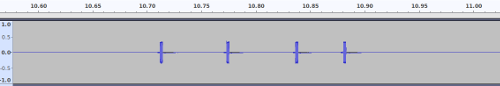
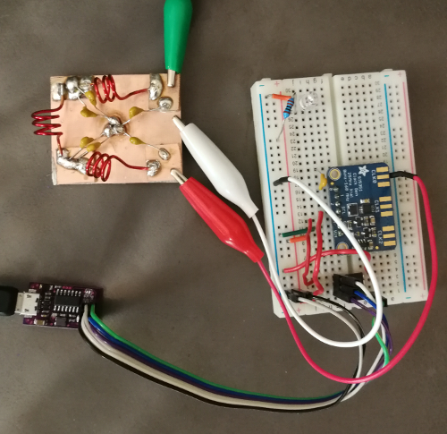
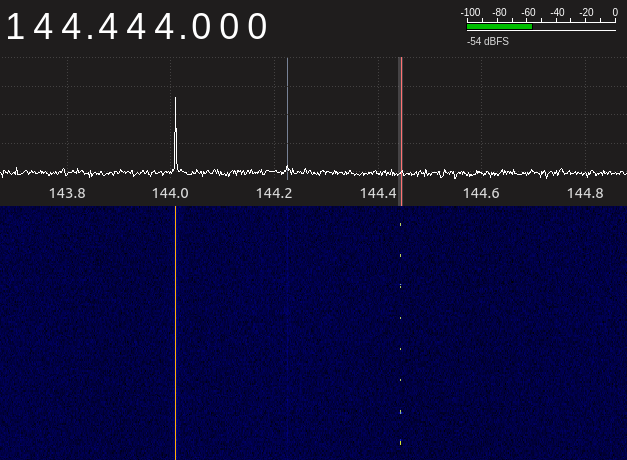

# MOTUS

[MOTUS](https://motus.org/) is a radio telemetry network for wildlife tracking.
It uses a coordinated frequency (166.380 MHz in North America) for each
transmitter allowing wildlife to be tracked as they migrate across the
continent.

Similar to the Nocturnal Flight Call (NFC) audio recording work, I was
interested in seeing whether or not I could detect radio signals from
migrants from my house. Most participants are university researchers for whom
the $1500 tag registration fee is not too onerous. It is easy enough to build a
receiver using a [RTL-SDR](https://www.rtl-sdr.com/) but without access to
tags, it is difficult to test whether or not it is working.

The goal of this project was to create a faux MOTUS tag to allow testing of a
receiver system.

Motus-Fauxtag
-------------

For my faux MOTUS tag, I chose a tranmission frequency of 144.444 MHz. This
was close enough to the MOTUS frequency of 166.380 MHz so an antenna designed
for the MOTUS frequency would also pick up the faux frequency, but lied within
the 2m amateur radio band so that I could legally transmit.

Building and operating a radio transmitter in Canada from scratch, not from a
kit requires an Advanced class amateur radio license, so the first step was to
study for that and write the Basic and Advanced tests.

The next step was to determine what the tranmission pattern from a MOTUS tag
looks like. I was unable to find any documentation on what the actual
tags transmitted, but fortunately, MOTUS tags are all registered into a
database, and some sample
[recordings](https://sensorgnome.org/@api/deki/files/5340/=CAWA_tags_(fall_2015).rar)
were available from the MOTUS site.

Opening the tag registration file in Audacity, the following pattern could be
seen:

From this it could be seen that the tags were either transmitting or not
(Morse code style) and all that was needed was to time the durations that they
were on and off.

I then built the following circuit:

I used an attiny-85, a Si5351 frequency generator, and a hand made low pass
filter designed for the 2m band. The low pass filter was based upon the notes
for a 2m filter on [QRP-Labs](https://qrp-labs.com/lpfkit.html). The inductors
are each three turns on 6mm air core, and the capacitor values are 22pF at the
ends and 40 pF in the middle.

Once the AVR programming was complete, I fired up Gqrx and tuned to 144.444
MHz. Sure enough, I could see my transmitter:

I took it for a quick walk, and with my RTL-SDR connected to a four element
yagi tuned for 166.380 MHz I was able to detect my transmitter at a distance
of a few 100m. For a longer test, I would need to program the transmitter to
also transmit my callsign.

## Recording Data

Rather than using Gqrx, it's possible to record using the RTL-SDL command line
tools, e.g.

    rtl_fm -M am -f 144.444M |sox -t raw -e signed -c 1 -b 16 -r 48000 - recording.wav

## Running the MOTUS Pulse Detector

Rather than utilize the full sensorgnome installation, it's possible to run
just the VAMP detector plugin against recorded data, e.g

    vamp-simple-host lotek-plugins.so:findpulsefdbatch ~/Downloads/CAWA\ tags\ \(fall\ 2015\)/CAWA2015_tag187@166.380.wav

Results
-------

Looking at the map of MOTUS stations, most lie to the south of me. The ones to
the north are around James Bay and Hudson Bay, which are prime shorebird
breeding territory, so my hope was to have my receiver completed in time for
shorebird migration season, which is primarily from August to September.
Unfortunately, my schedule slipped, and I was not able to begin recording
until October.

I recorded from Oct 1, 2018 to Oct 21, 2018. I did not detect any transmitters
in that time, but it was well outside of the prime shorebird migration season
for my location, so I count this as inconclusive rather than a failure.

I'm not certain whether I will try my receiver station again. I've become less
interested in these sort of unattended monitoring projects. I just don't find
trawling through huge amounts of data that interesting a way to spend my spare
time. It might be interesting to create a hand-held version of the receiver
and take it to suitable habitat during migration.

References & Credits
--------------------
The USI TWI master code is taken from Atmel Application Note 310,
[Using the USI module as a TWI Master](https://www.microchip.com/wwwAppNotes/AppNotes.aspx?appnote=en590897).
